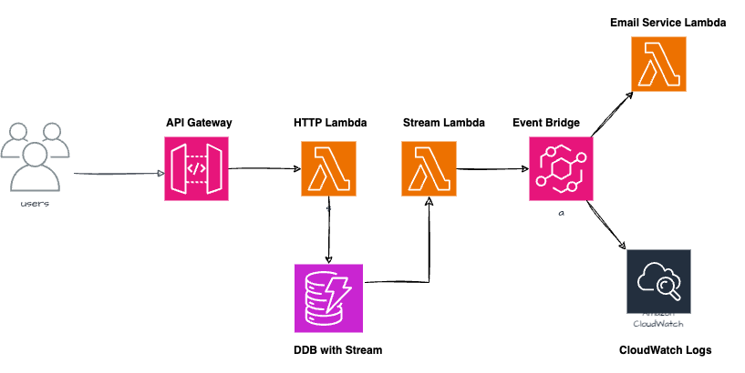

# Person Service Repository

This project defines an AWS Cloud infrastructure stack using AWS CDK(Typescript) to manage a person service repository. The stack leverages a combination of AWS Lambda, DynamoDB, API Gateway, and EventBridge to create a serverless architecture to perform CRUD operations on person records. Lambda's functional code(CRUD) is written in Go.

## Features

- **API Gateway**: Exposes endpoints for interacting with person records (`GET`, `POST`, `PUT`, `DELETE`).
- **Lambda Functions**: Processes HTTP requests from the API Gateway and DynamoDB Streams.
- **DynamoDB**: Stores person records, with streams enabled to trigger Lambda and EventBridge events.
- **EventBridge**: Routes DynamoDB Stream events to other services, like email notifications.
- **CloudWatch Logs**: Logs event data for debugging purposes.

## Architecture

The stack consists of:
- **DynamoDB Table**: Stores records with `personId` as the primary key. Streams are enabled to capture updates.
- **HTTP Lambda**: Handles CRUD requests through API Gateway and interacts with DynamoDB.
- **Stream Lambda**: Processes DynamoDB Stream events and publishes them to EventBridge.
- **EventBridge**: Routes events triggered by DynamoDB streams to the email notification Lambda and CloudWatch Logs.
- **Email Service Lambda**: This function would send email notifications based on events. For now, it serves as a placeholder.

## Infrastructure Diagram

## Installation and Deployment
   
1. **Clone the Repository**:
    git clone https://github.com/grvram01/person-service-repo.git
    cd person-service-repo

2. **Install Dependencies**:
    npm install

3. **Steps to Build Each Lambda Function:**:
   cd lambdas/http
   GOOS=linux GOARCH=amd64 go build -o main

   cd lambdas/stream
   GOOS=linux GOARCH=amd64 go build -o main
   
   cd lambdas/email
   GOOS=linux GOARCH=amd64 go build -o main

4. **Synthesize the Stack(To output Cloudformation template)**:
    cdk synth
    
5. **Deploy the Stack**:
    cdk deploy

## API Endpoints

The API Gateway exposes the following routes:

- `GET /persons`: Fetches all persons.
- `POST /persons`: Creates a new person.
- `GET /persons/{personId}`: Fetches a person by their ID.
- `PUT /persons/{personId}`: Updates a person record.

Sample CURLs: 

1. To create a new person record
    curl -X POST https://YOUR_API_ID.execute-api.YOUR_REGION.amazonaws.com/prod/persons \
     -H "Content-Type: application/json" \
     -d '{
           "firstName": "Tony",
           "phoneNumber": "1234567890",
           "lastName": "Stark",
           "address": "123 Main St"
         }'

2. To get a person's record
   curl -X GET https://YOUR_API_ID.execute-api.YOUR_REGION.amazonaws.com/prod/persons/{personId}
        
### Request Validation

The `POST /persons` endpoint uses a schema validation for the request body to ensure required fields are present:
- **firstName**: String (Required)
- **phoneNumber**: String (Required)
- **lastName**: String (Required)
- **address**: String (Required)

## Unit Testing(Using Jest and CDK assertions)

npm run test

## Cleanup

cdk destroy
